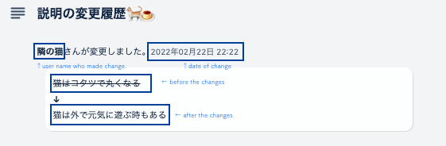

## What this?
This is a Chrome extension which is named "Description histories for Trello".
This program's function is depends on [Trello's api which is mentioned in Trello help.](https://help.trello.com/article/783-recovering-the-description-of-a-card-that-has-been-changed).
【NOTICE】This program is able to work in only Japanese, and date locale is set with japan by using [moment.js](https://momentjs.com/).

## How come I made this?
I'd wanted to check histories of card's discription on card to know what is changed.
I know that I can check them via request Trello api, but I'm feeling that way is not intuitive for non-programmer.
I'd wanted to make Trello's activities more comfortable, so I made this.

## Setup to use
You can use this function via The Chrome Webstore, or you can check this by downloading this repository to your pc, and load folder downloaded as an unpacked extension.

## How does it?
- Get your card's description histories of [Trello](https://trello.com/ja) by requesting [Trello's api which is mentioned in Trello help.](https://help.trello.com/article/783-recovering-the-description-of-a-card-that-has-been-changed).
- Display histories on each card.
- History information which will be displayed are who updates, when, before content and after content.

## Why this extension's icon is cat?
I have no reason. I just love it. Why not?

## License
 This project is released under the [MIT License](https://opensource.org/licenses/mit-license.php).
